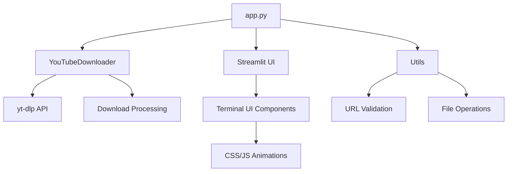

# 🔥 Terminal YouTube Downloader 🔥

<div align="center">
  
  
  
  
  
  
  
  <h3>🌐 Advanced YouTube Downloader with Hacker Aesthetic 🌐</h3>
  
  <p align="center">Download videos and audio from YouTube with a slick terminal-style interface, custom animations, and hacker vibes.</p>
</div>

---

## 📋 Table of Contents

- [✨ Features](#-features)
- [🖥️ Screenshots](#️-screenshots)
- [🔧 Installation](#-installation)
- [💻 Usage](#-usage)
- [🧩 Supported Formats](#-supported-formats)
- [🧪 Technical Implementation](#-technical-implementation)
- [🛠️ Project Structure](#️-project-structure)
- [🔄 Development Roadmap](#-development-roadmap)
- [📝 License](#-license)

---

## ✨ Features

<div style="display: flex; justify-content: space-between;">
<div>

- 🎬 **Video Download**: MP4, WebM in multiple resolutions
- 🎵 **Audio Extraction**: MP3 in various bitrates
- 🔍 **Video Info Extraction**: Title, uploader, duration, views
- 🎞️ **Playlist Support**: Download entire playlists
- 📋 **Format Selection**: Choose your preferred format and quality
- 📊 **Progress Tracking**: Real-time download progress
</div>
<div>

- 🌐 **URL Validation**: Ensures proper YouTube URL format
- 🔐 **Secure Downloads**: Sanitized filenames and error handling
- 📂 **Auto Directory Creation**: Organized file storage
- 🚀 **Async Processing**: Non-blocking download experience
- 🎨 **Hacker Terminal UI**: Custom Matrix-inspired interface
- 💾 **Auto Cleanup**: Optional old download removal
</div>
</div>

---

## 🖥️ Screenshots

<div align="center">
  
  &nbsp;&nbsp;
  
</div>

---

## 🔧 Installation

```bash
# Clone the repository
git clone https://github.com/yourusername/youtube-downloader.git
cd youtube-downloader

# Install dependencies
pip install -r dependencies.txt

# Install FFmpeg (required for audio conversion)
# Windows: Download from https://ffmpeg.org/download.html
# macOS: brew install ffmpeg
# Linux: sudo apt install ffmpeg
```

### System Requirements

- Python 3.11 or higher
- FFmpeg installed and in PATH
- Internet connection
- Write permissions for downloads directory

### Dependencies

| Package   | Version   | Purpose                      |
|-----------|-----------|------------------------------|
| streamlit | ≥1.46.0   | Web interface framework      |
| yt-dlp    | ≥2025.6.9 | YouTube downloading library  |

---

## 💻 Usage

```bash
# Start the application
streamlit run app.py
```

### Using the Terminal Interface

1. **Enter URL**: Paste a valid YouTube URL in the command prompt
2. **Extract Info**: Click "execute" to fetch video details
3. **Select Format**: Choose between MP4, MP3, or WebM
4. **Select Quality**: Pick your preferred resolution/bitrate
5. **Download**: Click "extract" to download the video/audio
6. **Find Files**: Check the "downloads" directory for your media

<div align="center">
  
</div>

---

## 🧩 Supported Formats

### Video Formats

| Format | Resolutions                        |
|--------|-----------------------------------|
| MP4    | Best, 1080p, 720p, 480p, 360p     |
| WebM   | Best, 1080p, 720p, 480p, 360p     |

### Audio Formats

| Format | Bitrates                          |
|--------|-----------------------------------|
| MP3    | Best, 128k, 96k, 64k              |

---

## 🧪 Technical Implementation

### 🔄 Core Components



### 🔧 Key Classes

- **YouTubeDownloader**: Core functionality for video/audio downloading
- **Utils**: Helper functions for validation, formatting, and file operations
- **Streamlit App**: Web interface with terminal aesthetics

---

## 🛠️ Project Structure

```
youtube-downloader/
├── app.py                 # Main Streamlit application
├── downloader.py          # YouTube download functionality
├── utils.py               # Helper utilities
├── dependencies.txt       # Project dependencies
├── pyproject.toml         # Project configuration
├── downloads/             # Downloaded files directory
└── static/                # UI assets
    ├── fire-animations.css # Fire animation styles
    ├── hacker-terminal.css # Terminal styling
    ├── matrix-rain.js     # Matrix background effect
    └── particles.js       # Particle animations
```

---

## 🔄 Development Roadmap

- [ ] Add dark/light theme toggle
- [ ] Implement batch URL processing
- [ ] Add custom download location option
- [ ] Integrate subtitle download feature
- [ ] Create browser extension
- [ ] Add video trimming functionality
- [ ] Implement search functionality
- [ ] Create desktop application wrapper

---

## 📝 License

This project is licensed under the MIT License - see the LICENSE file for details.

---

<div align="center">
  <p>
    
  </p>
  <p>
    <i>Built with ❤️ and ☕ by <a href="https://github.com/yourusername">Your Name</a></i>
  </p>
  <p>
    <i>Star this repository if you found it useful!</i>
  </p>
</div> 